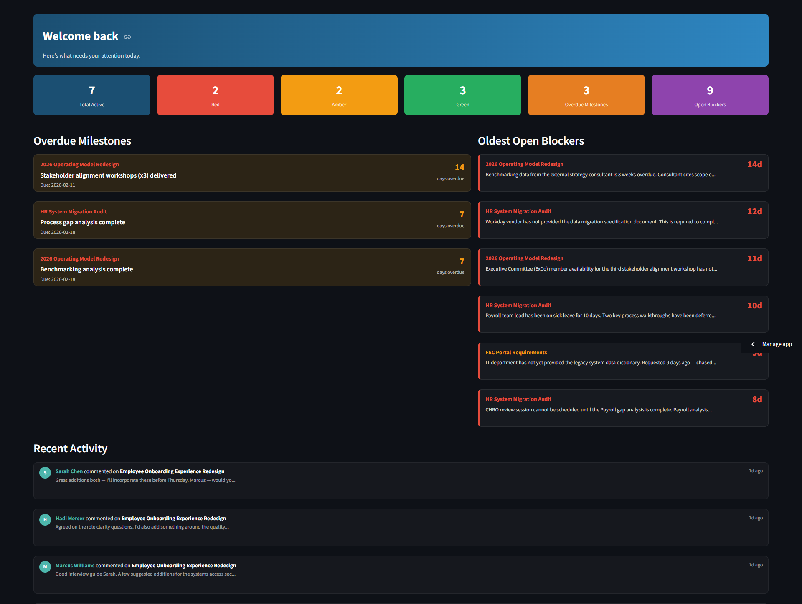
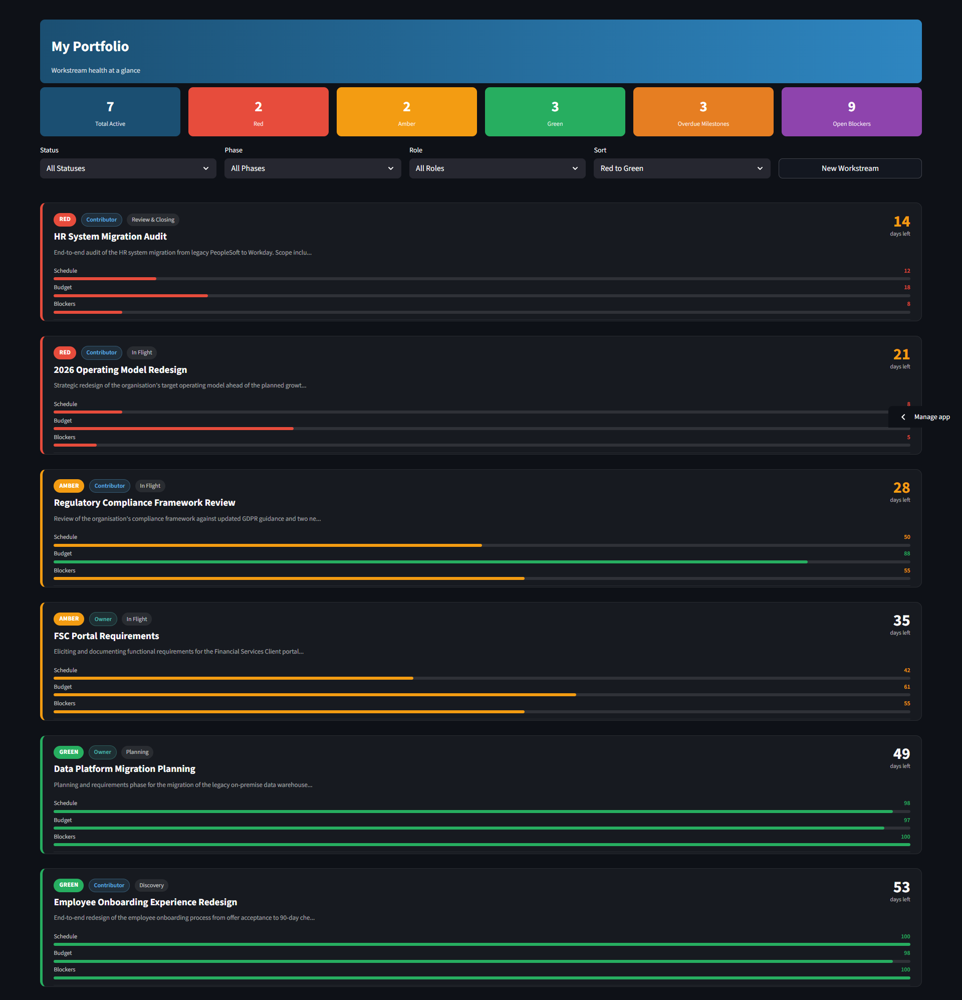
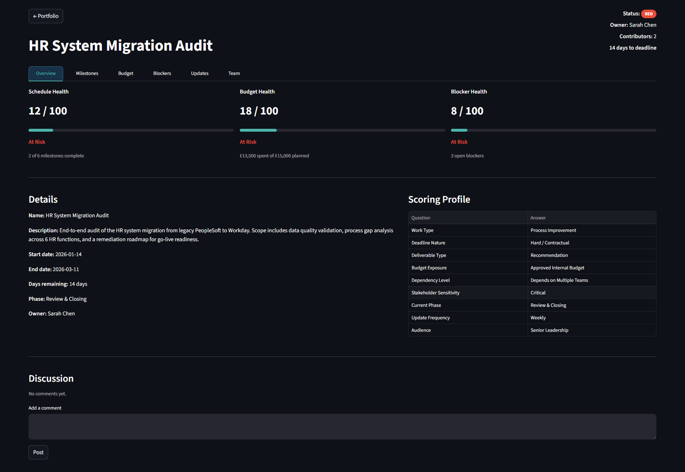
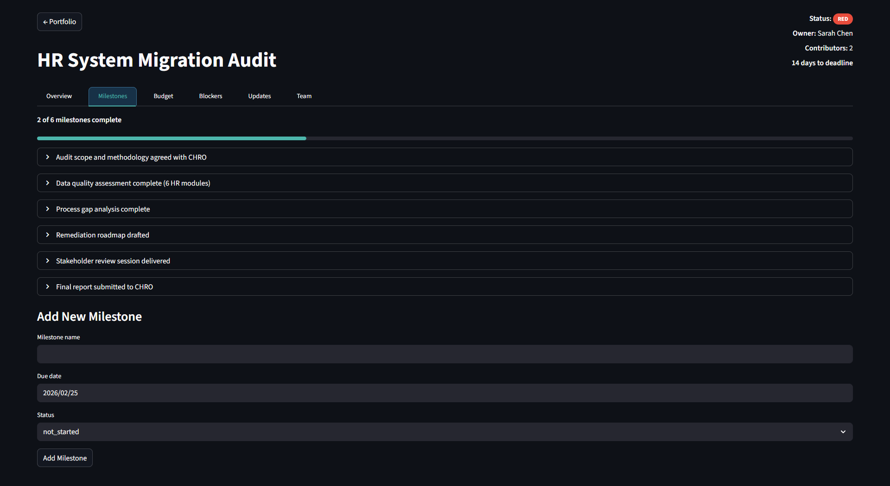
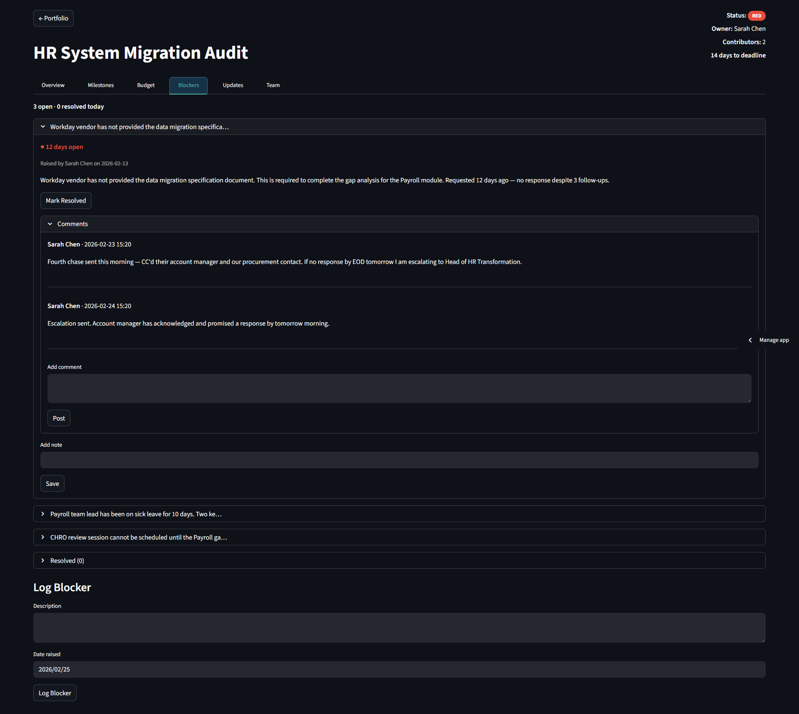
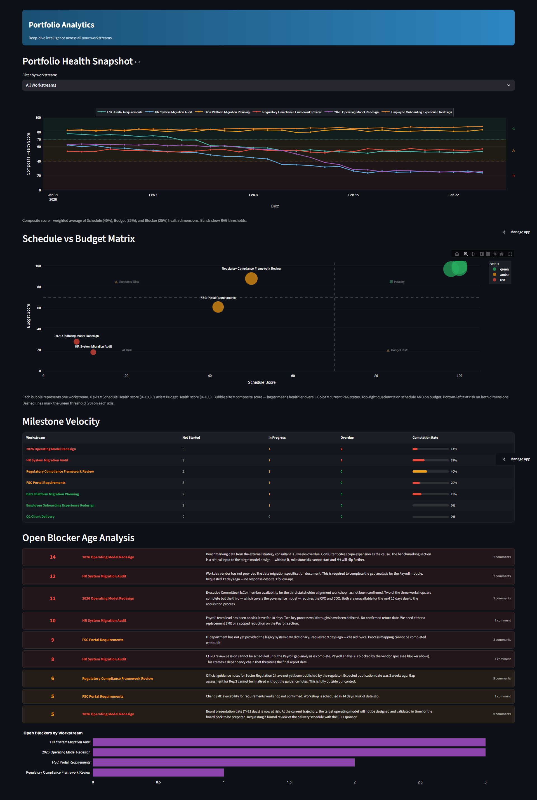

# Meridian — Workstream Portfolio Health Dashboard

**Portfolio Project S3 | Hadi Mercer | BA Portfolio 2026**

A full-stack multi-user web application where professionals track concurrent workstreams and receive a calculated RAG health status — automatically derived from milestone completion, budget burn rate, and blocker age. No manual colour-picking. The scoring engine reads the data and decides.

> Meridian is a standalone product concept, not a fictional company demo. The requirements, data model, and collaboration architecture reflect genuine product thinking applicable to any professional managing parallel work.

---

## Live Demo

🔗 **Application:** [meridian-hadimercer.streamlit.app](https://meridian-hadimercer.streamlit.app/)  
📁 **Portfolio Hub:** [github.com/hadimercer](https://github.com/hadimercer)

> **Demo credentials:** Email `demo@meridian.app` · Password `meridian2026`  
> The demo account has Viewer access to 6 pre-seeded workstreams with 30 days of historical score data.

---

## Screenshots

### Home — Pulse Bar, Overdue Milestones & Activity Feed


### Portfolio Dashboard — RAG Card Grid with Filter Bar


### Workstream Overview — Score Cards & Wizard Profile


### Milestones Tab — Progress Tracking & Comment Threads


### Blockers Tab — Age-Coloured Log with Resolution Tracking


### Analytics — Portfolio Health Trend & Scatter Matrix


---

## What This Project Demonstrates

| Capability | Evidence |
|---|---|
| Business Analysis | BABOK v3-aligned FRD, stakeholder archetypes, MoSCoW prioritisation, traceability matrix across 35 FRs |
| Product Thinking | Standalone SaaS concept — problem statement, personas, scoping decisions, design rationale documented |
| Requirements Engineering | 9-question context wizard with documented modifier matrix; scoring thresholds traceable to business logic |
| Database Design | PostgreSQL schema: 15+ tables, FK constraints, RLS policies, row-level security via Supabase |
| Full-Stack Development | Python + Streamlit frontend, psycopg2 DB layer, Supabase Auth, scoring engine as independent module |
| Scoring Engine Design | Calculated composite RAG from three weighted health dimensions with wizard-adjusted thresholds |
| Collaboration Architecture | Role-based access (Owner / Contributor / Viewer), invite link system, per-entity comment threads |
| Data Visualisation | Plotly trend chart with coloured bands, scatter matrix, milestone velocity, blocker age analysis |
| Documentation | BABOK-aligned FRD, UML class diagram, BPMN lifecycle diagram, data dictionary |
| Security | Supabase Auth, row-level security on all workstream data, no credentials in source code (NFR-02b) |

---

## The Core Idea

**The problem with existing tools is not missing features — it is a missing identity.**

Project managers use Jira and Asana. But business analysts, consultants, finance managers, and HR leads who manage work as a by-product of doing work do not think of themselves as project managers. Those tools are alienating and abandoned within weeks.

The fallback is a spreadsheet with a RAG column updated when there is time on a Friday afternoon. The spreadsheet does not alert when a workstream is drifting. It shows whatever was last typed.

**Meridian's central design principle:** health status is calculated, not declared. A user never selects a RAG colour. They enter objective data — milestone completions, spend figures, open blockers — and Meridian calculates what the data means. A 9-question context wizard at workstream creation tunes the scoring engine so a hard-deadline client engagement is scored differently from a self-imposed internal initiative.

---

## BA Process — How This Was Built

This section documents the business analysis process behind Meridian. The FRD (`docs/Meridian_FRD_v1.docx`) contains the complete artifact set; this section surfaces the thinking that drove the requirements, as that reasoning is as important as the output.

### 1. Problem Discovery → Target User Definition

The problem statement did not start as a feature list. It started with a single observation: professionals who manage parallel workstreams abandon structured tools quickly, then revert to spreadsheets with manually updated RAG columns. The core question was not "what should the tool do?" but "why do existing tools fail this user?"

Three stakeholder archetypes were defined before any functional requirements were written:

- **The Independent Operator** — a BA or consultant managing 3–5 concurrent engagements with no team, using tools solo, primarily needs a personal health signal and an honest prompt to act
- **The Team Lead** — manages a cross-functional team, needs to delegate data entry, control what information is visible to which role, and communicate status upward without manual aggregation
- **The Executive Reviewer** — no data entry, needs a single-screen portfolio health view and a trend line, will disengage immediately if the tool requires any learning curve

Each archetype drove different requirements. The Viewer role (FR-28, FR-30) exists specifically because the Executive Reviewer persona cannot be asked to manage data. The invite-link flow (FR-03, FR-30) exists because Team Leads need to onboard collaborators without an admin approval step. The staleness flag (FR-10, NFR-01a) exists because the Independent Operator needs the system to alert them when their own data has gone stale — they will not self-monitor.

### 2. Scoring Engine as a Requirements Problem

The most consequential design decision in Meridian was treating the RAG scoring engine as a requirements problem before a technical one. The temptation in any health-tracking tool is to let users set their own thresholds or pick their own RAG colour. This was explicitly rejected in the FRD's product philosophy section because it reproduces the exact failure mode of the spreadsheet: health status becomes a declaration rather than a calculation.

The 9-question wizard emerged from a specific requirements challenge: a hard-deadline client engagement and a self-imposed internal initiative cannot be scored by the same thresholds without producing meaningless results for one of them. The wizard answers are not preferences — they are inputs that change the scoring model. The modifier matrix in FRD Section 5.3 documents every combination and its effect on the three health dimensions.

This approach required defining the scoring logic as functional requirements (FR-07 to FR-10) with explicit acceptance criteria before any code was written. The scoring module (`pipeline/scoring.py`) was then built directly against those requirements, with the database schema designed to persist both the wizard configuration and the calculated scores for auditability (NFR-01a, NFR-01b).

### 3. Scope Discipline — What Was Deliberately Left Out

Several capabilities were scoped out of v1 with documented rationale in the FRD:

- **Notifications and alerts** were excluded because they require async infrastructure (email/SMS delivery, notification queues) that would add significant complexity without changing the core BA demonstration. The staleness flag serves the alerting intent at the UI level.
- **File attachments** were excluded because they introduce storage infrastructure and access control complexity disproportionate to their value for a v1 health-tracking tool.
- **Gantt chart or timeline view** was excluded because it repositions the product identity toward project management tools — exactly the category Meridian is designed to replace for non-PM users.
- **Public sharing** was excluded because it conflicts with the data sensitivity model. Workstream data often contains budget figures and blocker details that should not be publicly accessible.

Scoping decisions are documented in the FRD constraints and assumptions section. Each exclusion has a rationale. This is intentional — in a real engagement, unexplained scope boundaries are a common source of stakeholder misalignment.

---

## Application Architecture

```
Supabase Auth
       │
       ▼
pages/login.py
  ├── Email/password registration + verification
  └── Invite-link account creation → Viewer role

pages/home.py
  ├── Pulse bar (6 KPI tiles)
  ├── Overdue milestones panel
  ├── Oldest open blockers panel
  └── Activity feed (updates + comments, last 15)

pages/dashboard.py
  ├── Pulse bar
  ├── Filter bar (Status / Phase / Role / Sort)
  └── RAG card grid — clickable, hover effect

pages/create_workstream.py
  ├── Core fields (name, dates, budget)
  └── 9-question context wizard → stored wizard_config

pages/workstream.py  — 6 tabs
  ├── Overview:   score cards, details, wizard profile, discussion
  ├── Milestones: CRUD with status, due date, comments, pinned notes
  ├── Budget:     planned vs actual, burn rate, spend log
  ├── Blockers:   open log with age tracking, resolution workflow
  ├── Updates:    structured post feed (Owner/Contributor roles)
  └── Team:       member list, role management, invite link

pages/analytics.py
  ├── Portfolio health trend (composite score over 30 days)
  ├── Schedule vs Budget scatter matrix
  ├── Milestone velocity table
  └── Blocker age analysis
       │
       ▼
pipeline/scoring.py
  ├── Schedule Health:  SV = milestone_complete_pct - time_elapsed_pct
  ├── Budget Health:    BV = (planned_to_date - actual) / total_budget
  ├── Blocker Health:   score by open count + age, wizard-adjusted thresholds
  └── Composite RAG:    weighted average → Green ≥70 / Amber 40–69 / Red <40
       │
       ▼
PostgreSQL (Supabase)
  ├── users                       (Supabase Auth managed)
  ├── workstreams                 (core entity)
  ├── workstream_members          (Owner / Contributor / Viewer)
  ├── wizard_config               (9 answers per workstream)
  ├── rag_scores                  (calculated scores, is_stale flag)
  ├── rag_score_history           (daily snapshots for trend analytics)
  ├── milestones                  (status: not_started / in_progress / complete)
  ├── spend_entries               (auditable spend log)
  ├── blockers                    (open/resolved, age tracked)
  ├── updates                     (structured post feed with type tags)
  ├── comments                    (per entity_type + entity_id)
  ├── notes                       (pinned, one per entity)
  ├── invite_links                (token-based, Viewer on join)
  └── user_workstream_last_seen   (unread tracking)
```

---

## RAG Scoring Engine

The scoring engine is Meridian's core differentiator. RAG status is never a manually selectable field — it is recalculated from source data on every relevant change.

### Three Health Dimensions

**Schedule Health**
```
Schedule Variance (SV) = Milestone Completion % − Time Elapsed %

Green:  SV ≥ −10%       (on track)
Amber: −25% ≤ SV < −10% (lagging)
Red:    SV < −25%        (at risk)
```

**Budget Health**
```
Budget Variance (BV) = (Planned Spend to Date − Actual Spend) / Total Budget

Green:  BV ≥ −5%         (on budget)
Amber: −15% ≤ BV < −5%  (over plan)
Red:    BV < −15%         (budget at risk)
```

**Blocker Health**

| State | Score | Default Status |
|---|---|---|
| No open blockers | 100 | Green |
| 1 blocker, < 3 days | 80 | Green |
| 1 blocker, 3–7 days | 55 | Amber |
| 1 blocker, > 7 days | 25 | Red |
| 2+ blockers (any age) | 40 max | Amber+ |

### Composite Score
```
Composite = (Schedule × 0.40) + (Budget × 0.35) + (Blockers × 0.25)

Green ≥ 70  |  Amber 40–69  |  Red < 40
```

### Wizard Modifier Examples

| Wizard Answer | Effect |
|---|---|
| Hard/contractual deadline | Schedule Amber tightens: −10% → −5%; Red: −25% → −15% |
| Client-billable budget | Budget weight increases 35% → 45%; Amber at −3%, Red at −10% |
| Blocked by external party | Blocker age thresholds halved — risk accumulates faster |
| High / Critical risk | Amber-to-Red band compressed 5–10% across all dimensions |
| Review/Closing phase | Any incomplete milestone >2 days past due triggers Amber |

Full modifier matrix documented in `docs/Meridian_FRD_v1.docx` Section 5.3.

---

## Repository Structure

```
meridian/
├── docs/
│   ├── Meridian_FRD_v1.docx          # BABOK-aligned FRD (FR-01 to FR-35)
│   ├── uml_class_diagram.md          # UML class diagram — data model (FR-34)
│   ├── bpmn_lifecycle.md             # BPMN — workstream lifecycle + invite sub-process (FR-35)
│   ├── data_dictionary.md            # All tables, columns, types, definitions
│   └── screenshots/                  # Dashboard screenshots for README
├── pipeline/
│   ├── __init__.py
│   ├── auth.py                       # Supabase Auth helpers (login, session, roles)
│   ├── db.py                         # psycopg2 connection + cached query_df helper
│   ├── scoring.py                    # RAG scoring engine — all three dimensions
│   └── invite.py                     # Invite link generation and acceptance
├── pages/
│   ├── login.py                      # Registration, login, invite-link flow
│   ├── home.py                       # Landing page — pulse bar, overdue, activity
│   ├── dashboard.py                  # Portfolio card grid with filter bar
│   ├── create_workstream.py          # Workstream creation + wizard
│   ├── workstream.py                 # 6-tab workstream detail view
│   └── analytics.py                  # Portfolio health trend + analysis
├── .streamlit/
│   └── config.toml                   # Dark theme
├── app.py                            # Entry point
├── requirements.txt
├── .env                              # Credentials (git-ignored)
├── .gitignore
└── README.md                         # This file
```

---

## Application Pages

### Home
Command centre landing page. Pulse bar shows portfolio-level KPIs (total active, RAG counts, overdue milestones, open blockers). Left panel lists all overdue milestones sorted by days overdue. Right panel shows the oldest open blockers. Activity feed below shows the last 15 updates and comments across all workstreams. Every card is clickable — navigates directly to the relevant workstream.

### Portfolio Dashboard
Card grid of all active workstreams the user owns or has been invited to. Each card shows the composite RAG badge, role badge, phase, days to deadline, three score bars (Schedule / Budget / Blockers), and open blocker count. Filter bar: Status / Phase / Role / Sort. Cards are clickable with a subtle hover effect. `+ New Workstream` button inline with filters.

### Workstream — Overview Tab
Composite score cards (Schedule / Budget / Blockers) with progress bars and contributing data. Details panel (name, dates, phase, owner). Scoring Profile table showing all 9 wizard answers in human-readable form. Workstream-level discussion thread for Owners and Contributors.

### Workstream — Milestones Tab
Full CRUD for milestones with name, due date, and status (Not Started / In Progress / Complete). Completion percentage feeds Schedule Health scoring directly. Overdue incomplete milestones are flagged in red. Each milestone has a contextual comment thread and a pinned note field.

### Workstream — Budget Tab
Planned vs actual spend with budget variance (£ and %) and burn rate indicator. Auditable spend log — every entry is stored individually with date, category, and description. Budget Health score recalculates on each new entry. Suppressed dimension display when wizard Q4 is set to informal/no budget.

### Workstream — Blockers Tab
Open blocker log with age tracking from date raised. Age colour-coded (green < 3 days, amber 3–7, red > 7) using wizard-adjusted thresholds. Mark Resolved workflow with optional resolution note. Resolved blockers preserved in a collapsible history table. Per-blocker comment threads and pinned notes.

### Workstream — Updates Tab
Structured announcement feed. Post types: Status Update (Owner only), Decision Made, Risk Raised, Milestone Reached, General Announcement. Posts display type badge, author, and timestamp. Editable within 15 minutes of posting, locked after. Viewers can read but not post. New posts form at bottom.

### Workstream — Team Tab
Member list with role badges and join dates. Owner can promote Viewers to Contributor or demote Contributors. Invite link generation — anyone joining via link starts as Viewer; Owner promotes selectively. Former members retained with historical contributions attributed.

### Analytics
Portfolio health trend line chart from 30-day score history with coloured band overlays (green/amber/red zones). Schedule vs Budget scatter matrix with quadrant annotations. Milestone velocity table (Not Started / In Progress / Overdue / Completion Rate per workstream). Blocker age analysis table with comment counts and age-coloured rows.

---

## Setup Instructions

### Prerequisites
- Python 3.9+
- A free [Supabase](https://supabase.com) account

### 1. Clone the repository
```bash
git clone https://github.com/hadimercer/meridian.git
cd meridian
```

### 2. Install dependencies
```bash
pip install -r requirements.txt
```

### 3. Set up the database
Create a new Supabase project. Open the SQL Editor and run `docs/schema.sql` to create all tables, indexes, and RLS policies.

### 4. Configure environment variables
Create a `.env` file in the project root:
```
DB_HOST=your-supabase-pooler-host
DB_PORT=6543
DB_NAME=postgres
DB_USER=postgres.your-project-ref
DB_PASSWORD=your-supabase-password
SUPABASE_URL=https://your-project-ref.supabase.co
SUPABASE_ANON_KEY=your-supabase-anon-key
```

### 5. Launch the application
```bash
streamlit run app.py
```

### 6. Deploying to Streamlit Cloud
Push to GitHub. Connect the repo in [share.streamlit.io](https://share.streamlit.io). Add the environment variables above as secrets in the Streamlit Cloud dashboard using the TOML format:
```toml
DB_HOST = "your-supabase-pooler-host"
DB_PORT = "6543"
DB_NAME = "postgres"
DB_USER = "postgres.your-project-ref"
DB_PASSWORD = "your-password"
SUPABASE_URL = "https://your-project-ref.supabase.co"
SUPABASE_ANON_KEY = "your-anon-key"
```

---

## Portfolio Artifacts

| Artifact | File | Traces To |
|---|---|---|
| Functional Requirements Document | `docs/Meridian_FRD_v1.docx` | All FRs |
| UML Class Diagram — Data Model | `docs/uml_class_diagram.md` | FR-34 |
| BPMN — Workstream Lifecycle | `docs/bpmn_lifecycle.md` | FR-35 |
| Data Dictionary | `docs/data_dictionary.md` | FR-10 equivalent |
| Live Application | [meridian-hadimercer.streamlit.app](https://meridian-hadimercer.streamlit.app/) | FR-01 to FR-32 |

---

## Functional Requirements Coverage

| ID | Area | Requirement Summary | Status |
|---|---|---|---|
| FR-01 | Auth | Email/password registration + verification | ✅ |
| FR-02 | Auth | Login, logout, session management | ✅ |
| FR-03 | Auth | Invite-link account creation → Viewer role | ✅ |
| FR-04 | Setup | Create workstream with core fields | ✅ |
| FR-05 | Setup | 9-question wizard — required at creation | ✅ |
| FR-06 | Setup | Re-run wizard with change log | ✅ |
| FR-07 | RAG Engine | Auto-calculate all three health dimensions | ✅ |
| FR-08 | RAG Engine | Apply wizard modifier matrix to thresholds | ✅ |
| FR-09 | RAG Engine | Composite RAG from weighted dimension scores | ✅ |
| FR-10 | RAG Engine | Staleness flag when update cadence exceeded | ✅ |
| FR-11 | Dashboard | Card grid with RAG badge + sub-scores | ✅ |
| FR-12 | Dashboard | Show owned + invited workstreams, visually distinct | ✅ |
| FR-13 | Dashboard | Filter by RAG status, type, phase | ✅ |
| FR-14 | Dashboard | Summary strip — totals by RAG + stale count | ✅ |
| FR-15 | Overview | Wizard summary + composite scores + team | ✅ |
| FR-16 | Overview | Workstream-level comment thread | ✅ |
| FR-17 | Milestones | CRUD milestones feeding Schedule Health | ✅ |
| FR-18 | Milestones | Per-milestone comment thread + pinned note | ✅ |
| FR-19 | Milestones | Visual flag for overdue incomplete milestones | ✅ |
| FR-20 | Budget | Planned vs actual, variance, burn rate display | ✅ |
| FR-21 | Budget | Spend entry log with full history | ✅ |
| FR-22 | Budget | Suppressed dimension display for no-budget work | ✅ |
| FR-23 | Blockers | Blocker log with age tracking + Blocker Health | ✅ |
| FR-24 | Blockers | Per-blocker comment thread + pinned note | ✅ |
| FR-25 | Blockers | Age colour coding per wizard-adjusted thresholds | ✅ |
| FR-26 | Updates | Structured posts by type; Owner-only Status Update | ✅ |
| FR-27 | Updates | Post display with badge, author, timestamp; locked after 15min | ✅ |
| FR-28 | Updates | Viewers can read Updates, not post | ✅ |
| FR-29 | Team | Member list with roles; Owner can change roles | ✅ |
| FR-30 | Team | Invite link generation; new users join as Viewer | ✅ |
| FR-31 | Team | Remove member; retain historical contributions | ✅ |
| FR-32 | Archiving | Archive workstream; preserve full history | ✅ |
| FR-33 | Artifacts | BABOK-aligned FRD | ✅ |
| FR-34 | Artifacts | UML class diagram — data model | ✅ |
| FR-35 | Artifacts | BPMN — workstream lifecycle + invite sub-process | ✅ |

---

## Continuous Improvement Roadmap

Meridian is actively maintained as part of an ongoing BA portfolio. The v1 scope was bounded to demonstrate full-stack delivery and rigorous requirements thinking within a realistic timeline. The following enhancements are planned for future iterations and will be implemented progressively as skills develop across the broader portfolio.

### Phase 2 — Notifications & Async Intelligence

| Enhancement | Description | Priority |
|---|---|---|
| Email Notifications | Alert owners when a workstream crosses from Amber to Red, or when a milestone becomes overdue, reducing reliance on the user actively checking the app | High |
| Slack / Teams Integration | Push a daily portfolio health summary to a nominated channel, enabling passive awareness for users who live in messaging tools | Medium |
| Scheduled Score Recalculation | Run scoring engine on a background cron trigger so score drift is captured even when no data entry occurs | Medium |
| In-App Notification Centre | Centralised notification feed for mentions, status changes, and overdue alerts within the application itself | Low |

### Phase 3 — Reporting & Analytics

| Enhancement | Description | Priority |
|---|---|---|
| Exportable Status Report | One-click PDF or structured email summary of a workstream's current health, milestone status, and open blockers — formatted for upward reporting | High |
| Cross-Portfolio Benchmarking | Compare average health scores across workstream types, phases, or team sizes to identify patterns across the portfolio | Medium |
| Milestone Velocity Forecasting | Use historical completion rate to project whether the current workstream will meet its deadline at the current pace | Medium |
| Custom Scoring Profiles | Allow power users to define their own dimension weightings rather than relying solely on wizard-derived adjustments | Low |

### Phase 4 — Collaboration & Access

| Enhancement | Description | Priority |
|---|---|---|
| Guest View (No Account) | Time-limited read-only link for external stakeholders who need visibility without creating an account | High |
| SSO / OAuth Integration | Support Google or Microsoft login to reduce friction for professional users in corporate environments | Medium |
| Organisation-Level Accounts | Group multiple users under a shared organisation with admin management, enabling team-level portfolio views | Medium |
| File Attachments | Allow documents and images to be attached to milestones, blockers, and updates for richer context | Low |

### Phase 5 — AI-Assisted BA Features

| Enhancement | Description | Priority |
|---|---|---|
| Auto-Generated Status Summary | Use an LLM to generate a plain-English status update from the current workstream data — draft for the owner to review and post | High |
| Risk Identification | Analyse blocker patterns and schedule variance trends to surface a recommended risk flag before the RAG score reaches Red | Medium |
| Wizard Answer Suggestions | Based on workstream name, description, and phase, suggest likely answers to the context wizard to reduce setup friction | Low |

> **Note on portfolio maintenance:** These roadmap items will be implemented and documented progressively. Each feature build will be accompanied by updated FRD sections, revised data model artifacts where relevant, and README updates — maintaining the traceability discipline established in v1. The goal is not just to ship features but to demonstrate how a BA manages evolving requirements across a product lifecycle.

---

## Portfolio Context

This is **Smaller Project 3 (S3)** of a 6-project BA portfolio demonstrating an HR-to-BA career transition:

| # | Project | Focus |
|---|---|---|
| F1 | Operational Process Intelligence | What-if simulation |
| F2 | BA Co-Pilot | AI-powered artifact generation |
| S1 | HR Process Automation Hub | Workflow automation |
| S2 | Comp & Benchmarking Dashboard | BLS data pipeline + analytics |
| **S3** | **Meridian — Portfolio Health Dashboard** | **← This project** |
| S4 | Sentiment & Text Analytics | NLP analysis |

---

## Contact

**Hadi Mercer**  
LinkedIn: [linkedin.com/in/hadimercer](https://linkedin.com/in/hadimercer)  
GitHub: [github.com/hadimercer](https://github.com/hadimercer)
